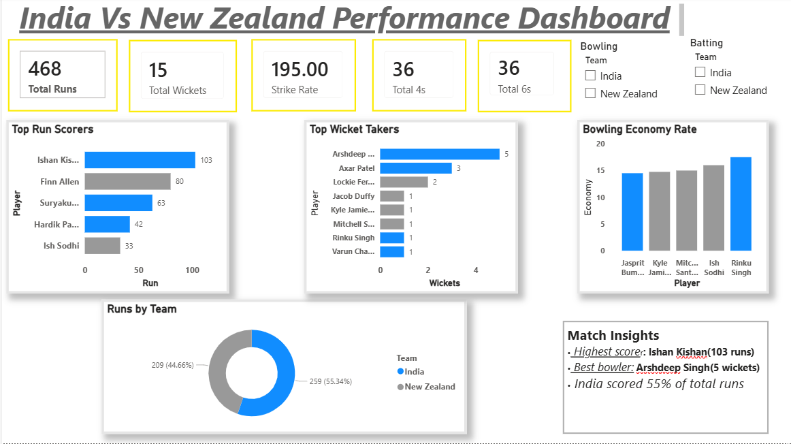

# 🇮🇳 India vs New Zealand – T20 Match Performance Dashboard

## 📊 Project Overview
This project analyzes the **T20 match performance between India and New Zealand** using an interactive **Power BI dashboard**.  

The dashboard provides insights into **batting performance, bowling performance, and overall match statistics** to identify key players and match impact.  

This project demonstrates **sports analytics, data visualization, and dashboard storytelling skills**.

---

## 📷 Dashboard Visualizations

## 🏏 Overall Match Dashboard
This dashboard provides a **complete match overview**, including total runs, wickets, strike rate, boundary statistics, and team contribution.

### Key Metrics Shown
- Total Runs  
- Total Wickets  
- Strike Rate  
- Total 4s and 6s  
- Team Run Distribution  

---

## 🇮🇳 India Batting vs New Zealand Bowling
This dashboard analyzes **India's batting performance against New Zealand bowlers**.

### Insights
- Top run scorers for India  
- Batting strike rate  
- Boundary contributions  
- Bowling performance of New Zealand bowlers  

---

## 🇮🇳 India Bowling vs New Zealand Batting
This dashboard focuses on **India's bowling performance against New Zealand's batting lineup**.

### Insights
- Top wicket-taking bowlers  
- Bowling economy rates  
- New Zealand batting contributions  

---

## 📊 Key Match Insights
- **Highest Scorer:** Ishan Kishan – 103 runs  
- **Best Bowler:** Arshdeep Singh – 5 wickets  
- **India scored 55% of total runs**

---

## 🛠 Tools & Technologies
- **Power BI** – Data visualization and dashboard development  
- **Microsoft Excel** – Data cleaning and preparation  

---

## 🎯 Project Objective
The objective of this project is to:

- Analyze **cricket match performance using data**
- Build **interactive sports analytics dashboards**
- Practice **data storytelling with Power BI**
