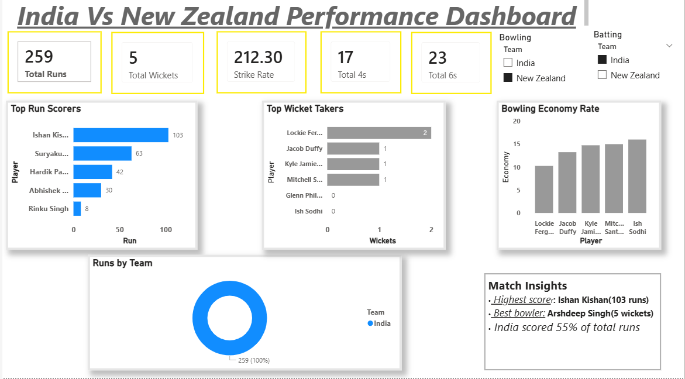
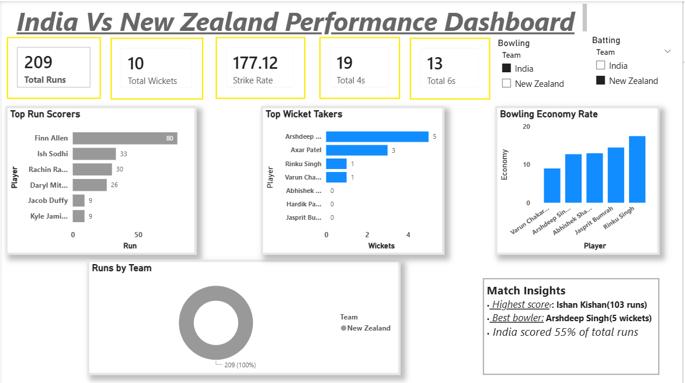

Project Overview

This project analyzes the T20 match performance between India and New Zealand using an interactive Power BI dashboard.

The dashboard provides insights into batting performance, bowling performance, and overall match statistics to identify key players and match impact.

This project demonstrates sports analytics, data visualization, and dashboard development skills.

📷 Dashboard Visualizations
🏏 Overall Match Dashboard

This dashboard provides a complete match summary, including total runs, wickets, strike rate, boundaries, and team run distribution.

Key highlights:

Total runs scored by both teams

Total wickets taken

Strike rate comparison

Boundary statistics (4s and 6s)

Team run contribution

🇮🇳 India Batting vs New Zealand Bowling

This dashboard focuses on India's batting performance against New Zealand's bowling attack.

Key insights:

Top run scorers for India

Total runs scored by the team

Boundary contributions

Bowling performance of New Zealand bowlers

🇮🇳 India Bowling vs New Zealand Batting

This section analyzes India's bowling performance against New Zealand's batting lineup.

Key insights:

Top wicket-taking bowlers
Bowling economy rates
Batting performance of New Zealand players

📊 Key Match Insights

Highest Scorer: Ishan Kishan – 103 runs
Best Bowler: Arshdeep Singh – 5 wickets
India contributed 55% of total runs in the match

🛠 Tools & Technologies

Power BI – Data visualization and dashboard development
Microsoft Excel – Data preparation and cleaning

🎯 Project Objective

The objective of this project is to:
Analyze cricket match performance using data
Build interactive sports analytics dashboards

Practice data storytelling through visualization
